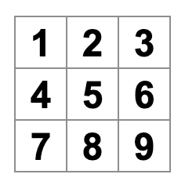
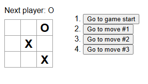

# Table of contents <!-- omit in toc -->

- [1. Initial setups](#1-initial-setups)
  - [1.1. React with JavaScript + Vite](#11-react-with-javascript--vite)
      - [1.1.0.1. Run the app](#1101-run-the-app)
- [2. The Tic Tac Toe app](#2-the-tic-tac-toe-app)
  - [2.1. Refactor/Clean up codes](#21-refactorclean-up-codes)
  - [2.2. Components](#22-components)
  - [2.3. index.css](#23-indexcss)
  - [2.4. main.jsx](#24-mainjsx)
  - [2.5. Building the board](#25-building-the-board)
  - [2.6. Re-usable component](#26-re-usable-component)
  - [2.7. Passing data through prop](#27-passing-data-through-prop)
  - [2.8. Making an interactive component (useState hook)](#28-making-an-interactive-component-usestate-hook)
  - [2.9. React Developer Tools](#29-react-developer-tools)
  - [2.10. Lifting state up](#210-lifting-state-up)
  - [2.11. Why immutability is important](#211-why-immutability-is-important)
  - [2.12. Taking turns](#212-taking-turns)
  - [2.13. Declaring a winner](#213-declaring-a-winner)
- [3. Adding time travel](#3-adding-time-travel)
  - [3.1. Storing a history of moves](#31-storing-a-history-of-moves)
  - [3.2. Lifting state up, again](#32-lifting-state-up-again)
  - [3.3. Showing the past moves](#33-showing-the-past-moves)
  - [3.4. Picking a key](#34-picking-a-key)
  - [3.5. Implementing time travel](#35-implementing-time-travel)

# 1. Initial setups

## 1.1. React with JavaScript + Vite

```bash
npm create vite@latest
```

Select JavaScript from the options

- Open the project directory in your code editor
- Open the terminal and install dependencies

```bash
npm install
```

#### 1.1.0.1. Run the app

```bash
npm run dev
```

- Check if you see the default page by Vite React in the browser.

# 2. The Tic Tac Toe app

## 2.1. Refactor/Clean up codes

- Remove the App.css file
- In App.jsx remove everything and paste the following codes

`App.jsx`

```jsx
export default function Square() {
  return <button className="square">X</button>
}
```

- In `index.css` replace everything with the following:

```css
* {
  box-sizing: border-box;
}

body {
  font-family: sans-serif;
  margin: 20px;
  padding: 0;
}

h1 {
  margin-top: 0;
  font-size: 22px;
}

h2 {
  margin-top: 0;
  font-size: 20px;
}

h3 {
  margin-top: 0;
  font-size: 18px;
}

h4 {
  margin-top: 0;
  font-size: 16px;
}

h5 {
  margin-top: 0;
  font-size: 14px;
}

h6 {
  margin-top: 0;
  font-size: 12px;
}

code {
  font-size: 1.2em;
}

ul {
  padding-inline-start: 20px;
}

* {
  box-sizing: border-box;
}

body {
  font-family: sans-serif;
  margin: 20px;
  padding: 0;
}

.square {
  background: #fff;
  border: 1px solid #999;
  float: left;
  font-size: 24px;
  font-weight: bold;
  line-height: 34px;
  height: 34px;
  margin-right: -1px;
  margin-top: -1px;
  padding: 0;
  text-align: center;
  width: 34px;
}

.board-row:after {
  clear: both;
  content: "";
  display: table;
}

.status {
  margin-bottom: 10px;
}
.game {
  display: flex;
  flex-direction: row;
}

.game-info {
  margin-left: 20px;
}
```

- Run the app

  ```bash
  npm run dev
  ```

- Check if you see the button with `X` in the browser

## 2.2. Components

The code in `App.jsx` creates a component.

`In React, a component is a piece of reusable code that represents a part of a user interface.`

Let’s look at the component line by line to see what’s going on:

`App.jsx`

```jsx
export default function Square() {
  return <button className="square">X</button>
}
```

1. The first line defines a function called 'Square'. The `export` JavaScript keyword makes this function accessible outside of this file. The `default` keyword tells that it’s the main function in this file.

2. The second line returns a button. The `return` JavaScript keyword means whatever comes after is returned as a value to the caller of the function.

3. `<button>` is a JSX element. A `JSX` element is a combination of JavaScript code and HTML tags that describes what you’d like to display.

4. className="square" is a button `property or prop` that tells CSS how to style the button

## 2.3. index.css

- This is the main css file created by vite-react

## 2.4. main.jsx

```jsx
import { StrictMode } from "react"
import { createRoot } from "react-dom/client"
import "./index.css"
import App from "./App.jsx"

createRoot(document.getElementById("root")!).render(
  <StrictMode>
    <App />
  </StrictMode>,
)
```

- it is the bridge between the component you created in the `App.jsx` file and the web browser.
- React DOM library talk to web browsers
- the App component is imported and called here

## 2.5. Building the board

Currently the board is only a single square, but we need nine! If we just try and copy paste our square to make two squares like this:

`App.jsx`

```jsx
export default function Square() {
  return <button className="square">X</button><button className="square">X</button>;
}
```

You'll get an error.

- React components need to return a single JSX element and not multiple adjacent JSX elements like two buttons.
- To fix this you can use any wrapper element like `<div>` or Fragments (<> and </>) to wrap multiple adjacent JSX elements like this:

App.jsx

```jsx
<>
  <button className="square">X</button>
  <button className="square">X</button>
  <button className="square">X</button>
  <button className="square">X</button>
  <button className="square">X</button>
  <button className="square">X</button>
  <button className="square">X</button>
  <button className="square">X</button>
  <button className="square">X</button>
</>
```

We created nine buttons.

But The squares are all in a single line, not in a grid like you need for our board.

To fix this, in the `App.js` file, update the Square component to look like this:

`App.jsx`

```jsx
export default function Square() {
  return (
    <>
      <div className="board-row">
        <button className="square">1</button>
        <button className="square">2</button>
        <button className="square">3</button>
      </div>

      <div className="board-row">
        <button className="square">4</button>
        <button className="square">5</button>
        <button className="square">6</button>
      </div>

      <div className="board-row">
        <button className="square">7</button>
        <button className="square">8</button>
        <button className="square">9</button>
      </div>
    </>
  )
}
```

- the className `board-row` is defined in index.css
- Now we have our tic-tac-toe board
- At this point let's rename out component as Board instead of Square (that makes sense)

`App.jsx`

```jsx
export default function Board() {
  //...
}
```

## 2.6. Re-usable component

With how you’ve built the board so far you would need to copy-paste the code that updates the square nine times!
Instead of copy-pasting, `React’s component architecture allows you to create a reusable component to avoid messy, duplicated code.`

First, you are going to copy the line defining your first square (`<button className="square">1</button>`) from your `Board` component into a new `Square` component and then you’ll update the `Board` component to render that `Square` component using JSX syntax:

> [!NOTE]
> Component names must start with capital letter

`App.jsx`

```jsx
function Square() {
  return <button className="square">1</button>
}

export default function Board() {
  return (
    <>
      <div className="board-row">
        <Square />
        <Square />
        <Square />
      </div>

      <div className="board-row">
        <Square />
        <Square />
        <Square />
      </div>

      <div className="board-row">
        <Square />
        <Square />
        <Square />
      </div>
    </>
  )
}
```

Oh no! Now each square says “1”.

## 2.7. Passing data through prop

To fix the current issue, you will use props to pass the value each square should have from the parent component (`Board`) to its child (`Square`).

Update the `Square` component to read the `value` prop that you’ll pass from the `Board`:

`App.jsx`

```jsx
function Square({ value }) {
  return <button className="square">{value}</button>
}
```

- Props can be destructured within curley braces as function argument
- To use the variable props we again need curley braces. Curley braces are the way to 'escape into JavaScript' from JSX.
- Now we should see empty board, because the `Board` component hasn’t passed the value prop to each `Square` component it renders yet.
- To fix it you’ll add the value prop to each `Square` component rendered by the `Board` component:

App.jsx

```jsx
export default function Board() {
  return (
    <>
      <div className="board-row">
        <Square value="1" />
        <Square value="2" />
        <Square value="3" />
      </div>

      <div className="board-row">
        <Square value="4" />
        <Square value="5" />
        <Square value="6" />
      </div>

      <div className="board-row">
        <Square value="7" />
        <Square value="8" />
        <Square value="9" />
      </div>
    </>
  )
}
```

Now you should see a grid of numbers again:



## 2.8. Making an interactive component (useState hook)

Let’s fill the `Square` component with an `X` when you click it.

- Declare a function called `handleClick` inside of the `Square`.
- Then, add `onClick` to the props of the button JSX element returned from the Square:

```jsx
function Square({ value }) {
  function handleClick() {
    console.log("clicked")
  }

  return (
    <button className="square" onClick={handleClick}>
      {value}
    </button>
  )
}
```

If you click on a square now, you should see a log saying "clicked!" in the Console tab of the Browser Dev Tool.

- As a next step, you want the Square component to “remember” that it got clicked, and fill it with an “X” mark. To “remember” things and update values, components use `state`.

- React provides a special function called `useState` that you can call from your component.
- Let’s store the current value of the `Square` in state, and change it when the `Square` is clicked.

- Import `useState` at the top of the file.
- Remove the `value` prop from the `Square` component. Instead, add a new line at the start of the `Square` that calls `useState`. Have it return a state variable called `value`:

**App.jsx**

```jsx
import { useState } from 'react';

function Square() {
  const [value, setValue] = useState(null);

  function handleClick() {
    //...
```

- `value` stores the value and `setValue` is a function that can be used to change the value. The null passed to `useState` is used as the initial value for this state variable.

- Since the `Square` component no longer accepts props anymore, you’ll remove the value prop from all nine of the `Square` components created by the `Board` component:

**App.jsx**

```jsx
// ...

export default function Board() {
  return (
    <>
      <div className="board-row">
        <Square />
        <Square />
        <Square />
      </div>

      <div className="board-row">
        <Square />
        <Square />
        <Square />
      </div>

      <div className="board-row">
        <Square />
        <Square />
        <Square />
      </div>
    </>
  )
}
```

- Now you’ll change `Square` to display an `“X”` when clicked.
- Replace the `console.log("clicked!");` event handler with `setValue('X');`.

**App.jsx**

```jsx
function handleClick() {
  setValue("X")
}
```

- By calling this set function from an onClick handler, you’re telling React to re-render that Square (with value= 'X') whenever its `<button>` is clicked.
- Click on any square, and `“X”` should show up.
- Each square has its own state: the value stored in each square is completely independent of the others.

## 2.9. React Developer Tools

React Developer Tools let you check the props and the state of your React components. It is available as a Chrome, Firefox, and Edge browser extension.

After you install the extension, a new `Components` tab will appear in your browser Developer Tools for sites using React.

To inspect a particular component on the screen, use the inspect button in the top left corner of the Components tab.

## 2.10. Lifting state up

Currently, each `Square` component maintains a part of the game’s state. To check for a winner in a tic-tac-toe game, the `Board` would need to somehow know the state of each of the 9 `Square` components.

the best approach is to store the game’s state in the parent `Board` component instead of in each `Square`. The `Board` component can tell each `Square` what to display by passing a prop.

> [!NOTE]
> To collect data from multiple children, or to have two child components communicate with each other, declare the shared state in their parent component instead. The parent component can pass that state back down to the children via props. This keeps the child components in sync with each other and with their parent.

Let's edit the `Board` component so that it declares a state variable named `squares` that defaults to an array of 9 nulls corresponding to the 9 squares:

**App.jsx**

```jsx
// ...
export default function Board() {
  const [squares, setSquares] = useState(Array(9).fill(null));
  return (
    // ...
  );
}
```

Now your `Board` component needs to pass the value prop down to each `Square` that it renders:

**App.jsx**

```jsx
export default function Board() {
  const [squares, setSquares] = useState(Array(9).fill(null))
  return (
    <>
      <div className="board-row">
        <Square value={squares[0]} />
        <Square value={squares[1]} />
        <Square value={squares[2]} />
      </div>
      <div className="board-row">
        <Square value={squares[3]} />
        <Square value={squares[4]} />
        <Square value={squares[5]} />
      </div>
      <div className="board-row">
        <Square value={squares[6]} />
        <Square value={squares[7]} />
        <Square value={squares[8]} />
      </div>
    </>
  )
}
```

Next, edit the `Square` component to receive the value prop from the `Board` component. Remove the `Square` component’s own stateful tracking of value and the button’s `onClick` prop:

**App.jsx**

```jsx
function Square({ value }) {
  return <button className="square">{value}</button>
}
```

At this point you should see an empty tic-tac-toe board.

Next, you need to change what happens when a Square is clicked.

_Since state is private to a component that defines it, you cannot update the `Board`’s state directly from `Square`._

Instead, you’ll pass down a function from the `Board` component to the `Square` component, and you’ll have `Square` receive that function as props and call it when a square is clicked.

**App.jsx**

```jsx
function Square({ value, onSquareClick }) {
  return (
    <button className="square" onClick={onSquareClick}>
      {value}
    </button>
  )
}
```

Now you’ll connect the `onSquareClick` prop to a function in the `Board` component, named `'handleClick'`. Then define the function to update squares array.

`App.jsx`

```jsx
export default function Board() {
  const [squares, setSquares] = useState(Array(9).fill(null))

  function handleClick() {
    const nextSquares = squares.slice()
    nextSquares[0] = "X"
    setSquares(nextSquares)
  }

  return (
    <>
      <div className="board-row">
        <Square value={squares[0]} onSquareClick={handleClick} />
        // ...
      </div>
      // ...
    </>
  )
}
```

The `handleClick` function creates a copy of the squares array (`nextSquares`) with the JavaScript `slice()` Array method.

Your `handleClick` function is hardcoded to update the index for the upper left square (0). Let’s update `handleClick` to be able to update any square.

```jsx
// ...
function handleClick(i) {
  const nextSquares = squares.slice()
  nextSquares[i] = "X"
  setSquares(nextSquares)
}
// ...
```

Next, you will need to pass that `i` to `handleClick`.

```jsx
<Square value={squares[0]} onSquareClick={handleClick(0)} />
```

`But this doesn’t work.` The `handleClick(0)` will call the function too early before the click. Eventually, this will lead to an infinite loop.

Let’s fix this and update all Square calls:

```jsx
export default function Board() {
  // ...
  return (
    <>
      <div className="board-row">
        <Square value={squares[0]} onSquareClick={() => handleClick(0)} />
        <Square value={squares[1]} onSquareClick={() => handleClick(1)} />
        <Square value={squares[2]} onSquareClick={() => handleClick(2)} />
      </div>
      <div className="board-row">
        <Square value={squares[3]} onSquareClick={() => handleClick(3)} />
        <Square value={squares[4]} onSquareClick={() => handleClick(4)} />
        <Square value={squares[5]} onSquareClick={() => handleClick(5)} />
      </div>
      <div className="board-row">
        <Square value={squares[6]} onSquareClick={() => handleClick(6)} />
        <Square value={squares[7]} onSquareClick={() => handleClick(7)} />
        <Square value={squares[8]} onSquareClick={() => handleClick(8)} />
      </div>
    </>
  )
}
```

Notice the new `() =>` syntax. When the square is clicked, the code after the `=>` “arrow” will run.

Now you can again add X’s to any square on the board by clicking on them. But this time all the state management is handled by the `Board` component!

> [!NOTE]
> The `<button>` element is a built-in component and its `onClick` property is also buit-in. For custom components like `Square`, you could give any name to the `Square`’s `onSquareClick` prop or Board’s `handleClick` function. In React, it’s conventional to use `onSomething` names for props which represent events and `handleSomething` for the function definitions which handle those events.

## 2.11. Why immutability is important

Note how in `handleClick`, you call `.slice()` to create a copy of the squares array instead of modifying the existing array. To explain why, we need to discuss immutability.

`Immutability` means replacing data with a new copy instead of modifying the existing data directly.

Here is what it looks like when we changed data without mutating the `squares` array:

```js
const squares = [null, null, null, null, null, null, null, null, null]

const nextSquares = ["X", null, null, null, null, null, null, null, null]

// Now `squares` is unchanged, but `nextSquares` first element is 'X' rather than `null`
```

**Why it matters:**

- Time travel: Keeping previous versions of data makes undo/redo and history features easier to implement.
- Performance: React can quickly compare whether data has changed by checking object references, making it easier to skip unnecessary re-renders when appropriate.

> _Rule:_ When updating arrays or objects in React state, create a new copy instead of mutating the existing data.

You can learn more about how React chooses when to re-render a component in [the memo API reference](https://react.dev/reference/react/memo).

## 2.12. Taking turns

It’s now time to fix a major defect in this tic-tac-toe game: the `O`s cannot be marked on the board.

You’ll set the first move to be `X` by default. Let’s keep track of this by adding another piece of state to the `Board` component:

```jsx
function Board() {
  const [xIsNext, setXIsNext] = useState(true)
  const [squares, setSquares] = useState(Array(9).fill(null))

  // ...
}
```

Each time a player moves, `xIsNext` (a boolean) will be flipped and the game’s state will be saved. You’ll update the `Board`’s `handleClick` function:

```jsx
export default function Board() {
  // ...

  function handleClick(i) {
    const nextSquares = squares.slice();
    if (xIsNext) {
      nextSquares[i] = "X";
    } else {
      nextSquares[i] = "O";
    }
    setSquares(nextSquares);
    setXIsNext(!xIsNext);
  }

  return (
    //...
  );
}
```

Now, as you click on different squares, they will alternate between `X` and `O`, as they should!

But wait, there’s a problem. Try clicking on the same square multiple times. The `X` is overwritten by an `O`!

You’ll fix this by checking if the square already has an `X` or an `O`. If the square is already filled, you will return in the `handleClick` function early—before it tries to update the board state.

```jsx
function handleClick(i) {
  // If the square is already filled, ignore updating it
  if (squares[i]) return

  const nextSquares = squares.slice()
  //...
}
```

Now you can only add `X`’s or `O`’s to empty squares!

## 2.13. Declaring a winner

Now that the players can take turns, you’ll want to show when the game is won and there are no more turns to make. To do this you’ll add a helper function called `calculateWinner` that takes an array of 9 squares, which represents the current state of the board, checks each winning combination for a winner and returns `'X'`, `'O'`, or `null` accordingly:

`App.jsx`

```jsx
export default function Board() {
  //...
}

function calculateWinner(squares) {
  // lines contains the 8 possible winning combination indices
  const lines = [
    [0, 1, 2], // top row
    [3, 4, 5], // middle row
    [6, 7, 8], // bottom row
    [0, 3, 6], // left column
    [1, 4, 7], // middle column
    [2, 5, 8], // right column
    [0, 4, 8], // diagonal
    [2, 4, 6], // diagonal
  ]

  for (let i = 0; i < lines.length; i++) {
    const [a, b, c] = lines[i]

    if (squares[a] && squares[a] === squares[b] && squares[a] === squares[c]) {
      return squares[a]
    }
  }
  // If there is no winner
  return null
}
```

> [!NOTE]
> It does not matter whether you define `calculateWinner` before or after the `Board`

You will call `calculateWinner(squares)` in the `Board` component’s `handleClick` function to check if a player has won. You can perform this check at the same time you check if a user has clicked a square that already has an `X` or an `O`. We’d like to return early in both cases:

`App.jsx`

```jsx
function handleClick(i) {
  if (squares[i] || calculateWinner(squares)) {
    return
  }
  const nextSquares = squares.slice()
  //...
}
```

To let the players know when the game is over, you can display text such as “Winner: X” or “Winner: O”. To do that you’ll add a `status` section to the `Board` component. The status will display the winner if the game is over and if the game is ongoing you’ll display which player’s turn is next:

`App.jsx`

```jsx
export default function Board() {
  // ...

  // Game status
  const winner = calculateWinner(squares)
  let status
  if (winner) {
    status = `Winner: ${winner} 👍`
  } else {
    status = `Next player: ${xIsNext ? "X" : "0"}`
  }

  return (
    <>
      <div className="status">{status}</div>
      <div className="board-row">
        // ...
  )
}
```

Congratulations! You now have a working tic-tac-toe game. And you’ve just learned the basics of React too.

# 3. Adding time travel

As a final exercise, let’s make it possible to “go back in time” to the previous moves in the game.

## 3.1. Storing a history of moves

You used `slice()` to create a new copy of the squares array after every move. This will allow you to store every past version of the squares array, and navigate between them.

You’ll store the past squares arrays in another array called `history`, as a new state variable. The `history` array represents all board states, from the first to the last move, and has a shape like this:

```js
;[
  // Before first move
  [null, null, null, null, null, null, null, null, null],
  // After first move
  [null, null, null, null, "X", null, null, null, null],
  // After second move
  [null, null, null, null, "X", null, null, null, "O"],
  // ...
]
```

## 3.2. Lifting state up, again

You will now write a new top-level component called `Game`. Here, you will place the `history` state that contains the entire game history.

You'll also remove the `squares` state from its child `Board` component and lift it up into the top-level `Game` component. This gives the `Game` component full control over the `Board`’s data and lets it instruct the `Board` to render previous turns from the history.

First, add a `Game` component with export default. Have it render the `Board` component and some markup:

```jsx
function Board() {
  // ...
}

export default function Game() {
  return (
    <div className="game">
      <div className="game-board">
        <Board />
      </div>
      <div className="game-info">
        <ol>{/*TODO*/}</ol>
      </div>
    </div>
  )
}
```

Note that we're now default exporting the `Game` component instead of `Board`.

Add some state to the `Game` component to track which player is next and the history of moves:

```jsx
export default function Game() {
  const [xIsNext, setXIsNext] = useState(true);
  const [history, setHistory] = useState([Array(9).fill(null)]);
  // ...
```

Notice how `[Array(9).fill(null)]` is an array with a single item, which itself is an array of 9 nulls.

To render the squares for the current move, you’ll want to read the last squares array from the `history`:

```jsx
export default function Game() {
  const [xIsNext, setXIsNext] = useState(true);
  const [history, setHistory] = useState([Array(9).fill(null)]);
  const currentSquares = history[history.length - 1];
  // ...
```

Next, create a `handlePlay` function inside the `Game` component that will be called by the `Board` component to update the game. Pass `xIsNext`, `currentSquares` and `handlePlay` as props to the `Board` component:

```jsx
export default function Game() {
  const [xIsNext, setXIsNext] = useState(true);
  const [history, setHistory] = useState([Array(9).fill(null)]);
  const currentSquares = history[history.length - 1];

  function handlePlay(nextSquares) {
    // TODO
  }

  return (
    <div className="game">
      <div className="game-board">
        <Board xIsNext={xIsNext} squares={currentSquares} onPlay={handlePlay} />
        //...
  )
}
```

Change the `Board` component to take the three props: `xIsNext`, `squares`, and a new `onPlay` function that `Board` can call with the updated squares array when a player makes a move. Next, remove the first two lines of the `Board` function that call `useState`:

```jsx
function Board({ xIsNext, squares, onPlay }) {
  function handleClick(i) {
    //...
  }
  // ...
}
```

Now replace the `setSquares` and `setXIsNext` calls in `handleClick` with a single call to `onPlay` function so the `Game` component can update the `Board` when the user clicks a square:

```jsx
function Board({ xIsNext, squares, onPlay }) {
  function handleClick(i) {
    if (calculateWinner(squares) || squares[i]) {
      return
    }
    const nextSquares = squares.slice()
    if (xIsNext) {
      nextSquares[i] = "X"
    } else {
      nextSquares[i] = "O"
    }
    onPlay(nextSquares)
  }
  //...
}
```

Now, you need to implement the `handlePlay` function in the `Game` component to get the game working again.

What should `handlePlay` do when called? The `handlePlay` function needs to update Game’s state to trigger a re-render.

Notice that `Board` passes the updated squares array to `onPlay`. You’ll want to update `history` by appending the updated `squares` array (`nextSquares`) as a new history entry. You also want to toggle `xIsNext`, just as `Board` used to do:

```jsx
export default function Game() {
  //...
  function handlePlay(nextSquares) {
    setHistory([...history, nextSquares])
    setXIsNext(!xIsNext)
  }
  //...
}
```

Here, `[...history, nextSquares]` creates a new array that contains all the items in `history`, followed by `nextSquares`.

At this point, you’ve moved the state to live in the `Game` component, and the UI should be fully working, just as it was before the refactor.

## 3.3. Showing the past moves

Since you are recording the history, you can now display a list of past moves to the player.

You already have an array of history moves in state, so now you need to transform it to an array of React `<button>` elements. You’ll use array `map` method to transform your history of moves into React elements representing buttons on the screen to “jump” to past moves. Let’s `map` over the history in the `Game` component:

```jsx
export default function Game() {
  // ...

  function handlePlay(nextSquares) {
    // ...
  }

  function jumpTo(nextMove) {
    // TODO
  }

  const moves = history.map((squares, move) => {
    let description
    if (move > 0) {
      description = "Go to move #" + move
    } else {
      description = "Go to game start"
    }
    return (
      <li>
        <button onClick={() => jumpTo(move)}>{description}</button>
      </li>
    )
  })

  return (
    <div className="game">
      {/* ... */}
      <div className="game-info">
        <ol>{moves}</ol>
      </div>
    </div>
  )
}
```

Here, the `square` argument goes through each element of history, and the move argument goes through each array index.

For now, you should see a list of the moves that occurred in the game:



You'll also see an error in the developer tools console saying:

```
Warning: Each child in an array or iterator should have a unique “key” prop.
```

Let’s discuss what the “key” error means.

## 3.4. Picking a key

When you update a list, React needs to determine what has changed. You could have added, removed, re-arranged, or updated the list’s items.

Imagine transitioning from

```html
<li>Alexa: 7 tasks left</li>
<li>Ben: 5 tasks left</li>
```

to

```html
<li>Ben: 9 tasks left</li>
<li>Claudia: 8 tasks left</li>
<li>Alexa: 5 tasks left</li>
```

React is a computer program and does not know what you intended, so you need to specify a key property for each list item to differentiate each list item from its siblings. If your data was from a database, Alexa, Ben, and Claudia’s database IDs could be used as keys.

```jsx
<li key={user.id}>
  {user.name}: {user.taskCount} tasks left
</li>
```

When a list is re-rendered, React takes each list item’s key and searches the previous list’s items for a matching key. If the current list has a key that didn’t exist before, React creates a component. If the current list is missing a key that existed in the previous list, React destroys the previous component. If two keys match, the corresponding component is moved.

Keys tell React about the identity of each component, which allows React to maintain state between re-renders. If a component’s key changes, the component will be destroyed and re-created with a new state.

`Key is a special and reserved property in React. React automatically uses key to decide which components to update.`

It’s strongly recommended that you assign proper keys whenever you build dynamic lists.

If no key is specified, React will report an error and use the array index as a key by default. Using the array index as a key is problematic when trying to re-order a list’s items or inserting/removing list items. Explicitly passing `key={i}` silences the error but has the same problems as array indices and is not recommended in most cases.

Keys do not need to be globally unique; they only need to be unique between components and their siblings.

## 3.5. Implementing time travel

In the tic-tac-toe game’s history, the moves will never be re-ordered, deleted, or inserted in the middle, so it’s safe to use the move index as a key.

In the `Game` function, you can add the key as `<li key={move}>`, and if you reload the rendered game, React’s “key” error should disappear:

`App.jsx`

```jsx
<li key={move}>
  <button onClick={() => jumpTo(move)}>{description}</button>
</li>
```

Before you can implement `jumpTo`, you need the `Game` component to keep track of which step the user is currently viewing. To do this, define a new state variable called `currentMove`, defaulting to `0`:

```jsx
export default function Game() {
  const [xIsNext, setXIsNext] = useState(true)
  const [history, setHistory] = useState([Array(9).fill(null)])
  const [currentMove, setCurrentMove] = useState(0)
  const currentSquares = history[history.length - 1]
  //...
}
```

Next, update the `jumpTo` function inside `Game` to update that `currentMove`. You’ll also set `xIsNext` to `true` if the number that you’re changing `currentMove` to is even.

```jsx
export default function Game() {
  // ...
  function jumpTo(nextMove) {
    setCurrentMove(nextMove)
    // X's moves are: 0, 2, 4, 6, .... even numbers
    setXIsNext(nextMove % 2 === 0)
  }
  //...
}
```

You will now make two changes to the Game’s `handlePlay` function which is called when you click on a square.

- If you “go back in time” and then make a new move from that point, you only want to keep the history up to that point. Instead of adding `nextSquares` after all items (`...` spread syntax) in `history`, you’ll add it after all items in `history.slice(0, currentMove + 1)` so that you’re only keeping that portion of the old history.
- Each time a move is made, you need to update `currentMove` to point to the latest history entry.

```jsx
function handlePlay(nextSquares) {
  const nextHistory = [...history.slice(0, currentMove + 1), nextSquares]
  setHistory(nextHistory)
  setCurrentMove(nextHistory.length - 1)
  setXIsNext(!xIsNext)
}
```

Finally, you will modify the `Game` component to render the currently selected move, instead of always rendering the final move:

```jsx
export default function Game() {
  const [xIsNext, setXIsNext] = useState(true)
  const [history, setHistory] = useState([Array(9).fill(null)])
  const [currentMove, setCurrentMove] = useState(0)
  const currentSquares = history[currentMove]

  // ...
}
```

Now, if you click on any step in the game’s history, the tic-tac-toe board should immediately update to show what the board looked like after that step occurred.
